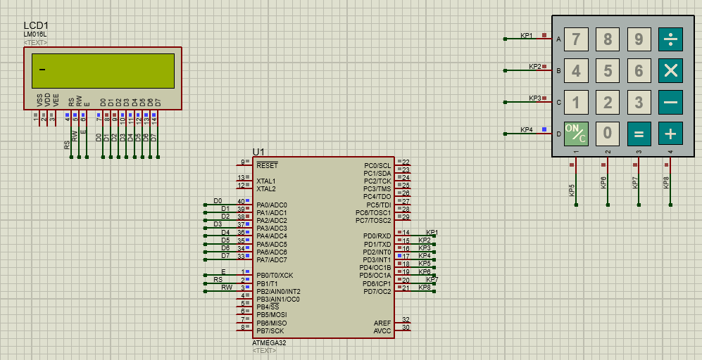

# ATmega32 Embedded Systems Calculator

## Project Overview
A high-performance digital calculator project designed using the AVR ATmega32 microcontroller. This project demonstrates interfacing between a microcontroller, a 4x4 matrix keypad, and a 16x2 LCD display to perform real-time arithmetic operations.

## Hardware Components
The circuit is designed in Proteus and consists of:
- Microcontroller: ATmega32 (AVR Architecture)
- Display: 16x2 Alpha-Numeric LCD (LM016L)
- Input: 4x4 Matrix Keypad
- Power Source: 5V DC

## Circuit Schematic
The following image illustrates the connection between the ATmega32 pins and the peripherals:

### Connection Mapping:
- PORTA (PA0 - PA7): Connected to LCD Data pins (D0 - D7) for 8-bit communication.
- PORTB (PB0, PB1, PB2): Connected to LCD Control pins (RS, RW, E).
- PORTD (PD0 - PD7): Connected to the 4x4 Keypad matrix (Rows and Columns).

## Project Structure
The repository is organized as follows:
- code/: Contains the C/C++ source code and header files.
- calculator.pdsprj: The Proteus design file for simulation.

## How to Run
1. Clone this repository to your local machine.
2. Open the 'calculator.pdsprj' file using Proteus 8.0 or higher.
3. Load the .hex file (found in the code folder) into the ATmega32 component.
4. Run the simulation and use the keypad to perform calculations.
